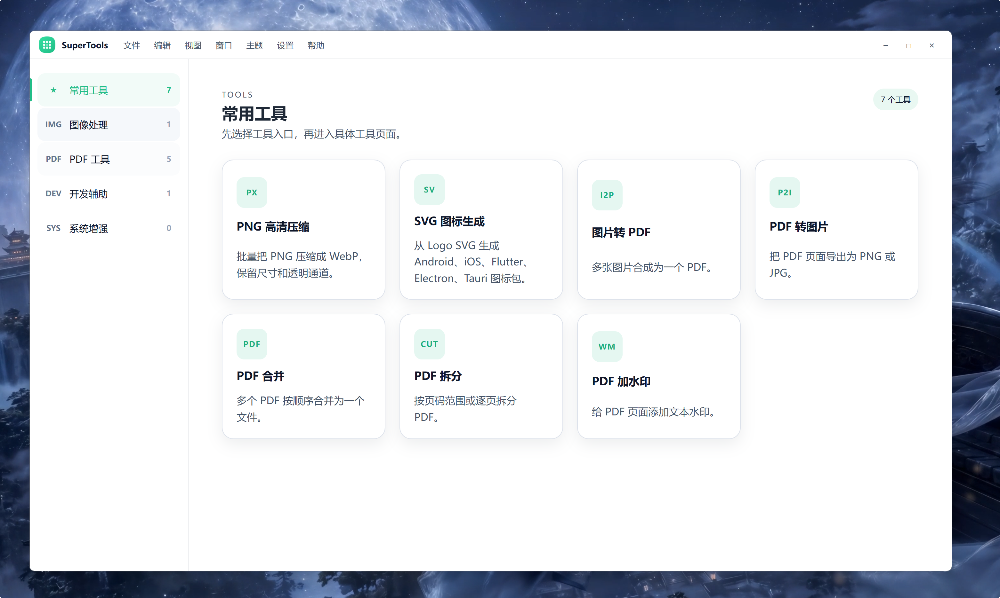

# SuperTools

A lightweight desktop productivity toolbox built with `Tauri 2 + React + TypeScript + Rust`. The project focuses on local image, SVG, and PDF workflows while keeping the desktop app small, fast, and suitable for cross-platform use.

[中文](./README.md)



## Features

### Image Tools

- High-quality PNG compression with multi-file selection, folder selection, and drag-and-drop input.
- Export formats: `WebP`, `AVIF`, `PNG`, and `JPG/JPEG`.
- Compression presets: balanced, high quality, and smaller size. Outputs larger than the source can be skipped.

### SVG Icon Generation

- Export SVG code as a single image with custom size, format, and padding.
- Generate icon sets for Android, iOS, Flutter, Electron, and Tauri projects.
- Supports transparent preview and transparent output.

### PDF Tools

- Images to PDF.
- PDF to images.
- Merge PDFs.
- Split PDF.
- Add text watermark to PDF.

> Note: PDF watermarking currently uses a rasterized workflow. Pages are rendered to images, watermarked, and rebuilt into a PDF. This is suitable for common internal workflows. For selectable text, vector clarity, and smaller output size, this should later be upgraded to a true PDF overlay implementation.

## Tech Stack

- Desktop framework: Tauri 2
- Frontend: React, TypeScript, Vite
- Backend: Rust
- Image encoders: `cwebp`, `avifenc`
- PDF engine: MuPDF `mutool`
- SVG rendering: `resvg`

## Project Structure

```text
.
├─ src/                 # React frontend
├─ src-tauri/           # Tauri / Rust backend
├─ src-tauri/binaries/  # Local sidecar binaries, actual binaries are not committed
├─ public/              # App static assets
├─ public-res/          # Documentation assets
└─ scripts/             # Project scripts
```

## Local Development

### Requirements

- Node.js
- Rust / Cargo
- Visual Studio C++ Build Tools on Windows
- Platform dependencies required by Tauri 2

### Install Dependencies

```bash
npm install
```

### Prepare Sidecar Binaries

The app uses Tauri sidecars to call external command-line tools. Binary files are platform-specific and relatively large, so they are not committed by default.

Place the following files in `src-tauri/binaries/`:

```text
cwebp-x86_64-pc-windows-msvc.exe
cwebp-x86_64-apple-darwin
cwebp-aarch64-apple-darwin

avifenc-x86_64-pc-windows-msvc.exe
avifenc-x86_64-apple-darwin
avifenc-aarch64-apple-darwin

mutool-x86_64-pc-windows-msvc.exe
mutool-x86_64-apple-darwin
mutool-aarch64-apple-darwin
```

See [src-tauri/binaries/README.txt](./src-tauri/binaries/README.txt) for details.

### Run in Development

```bash
npm run tauri:dev
```

The frontend dev server runs at:

```text
http://127.0.0.1:1420
```

### Check and Build

```bash
npm run check
npm run build
cd src-tauri
cargo check
```

Build the desktop app:

```bash
npm run tauri:build
```

## Status

This project is still in early development. The main tool modules have working local implementations. Code signing, auto updates, public distribution, localization, and automatic sidecar downloads are not part of the current version.

## License

No open-source license has been selected yet. Add a `LICENSE` file before publishing the project publicly if needed.
